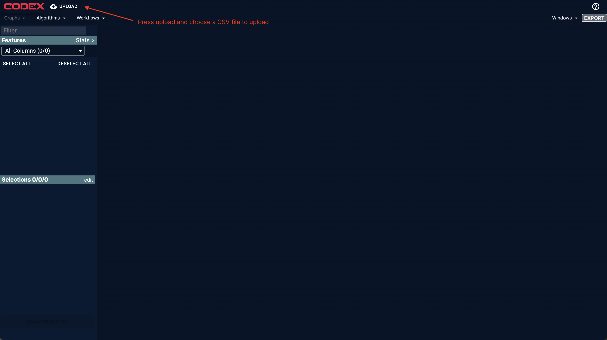
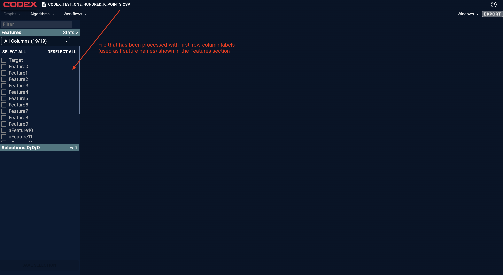
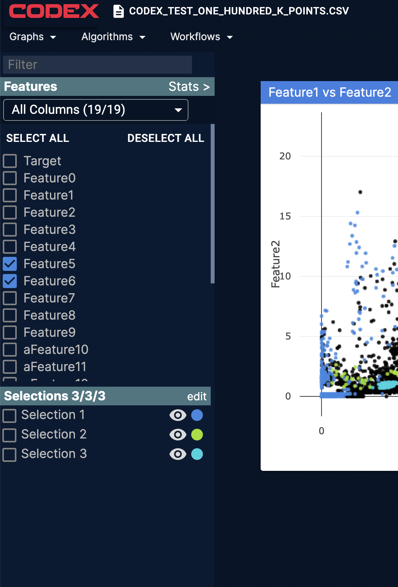
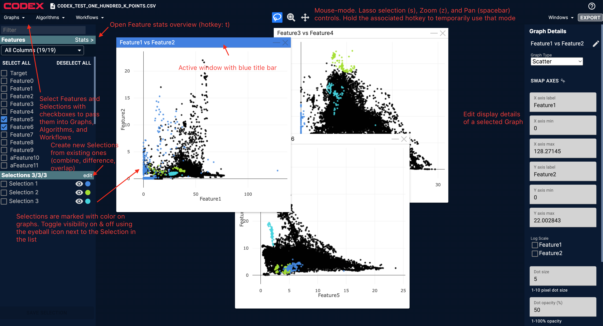
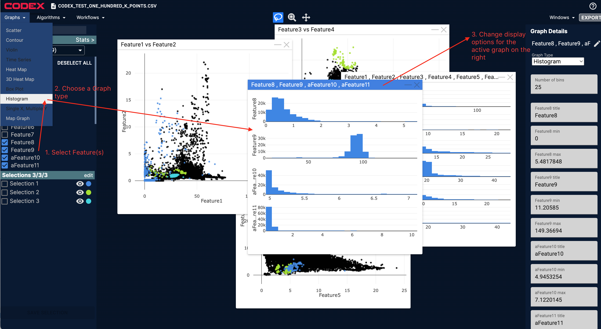
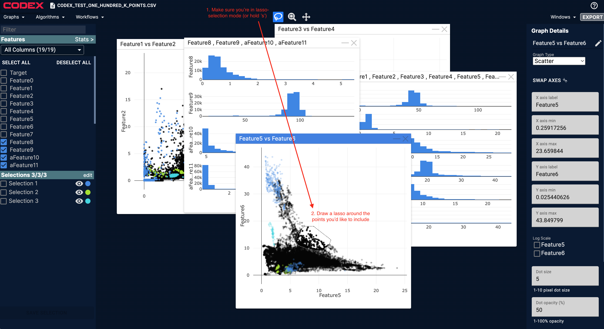
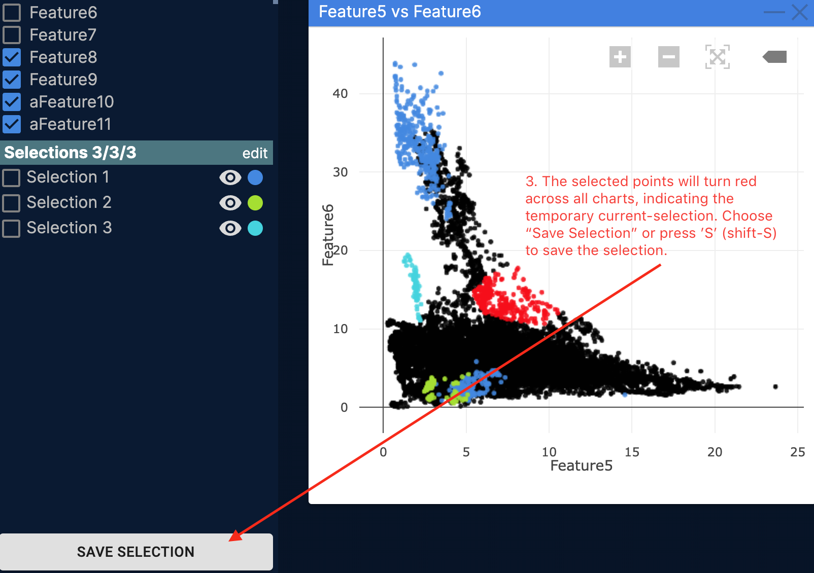
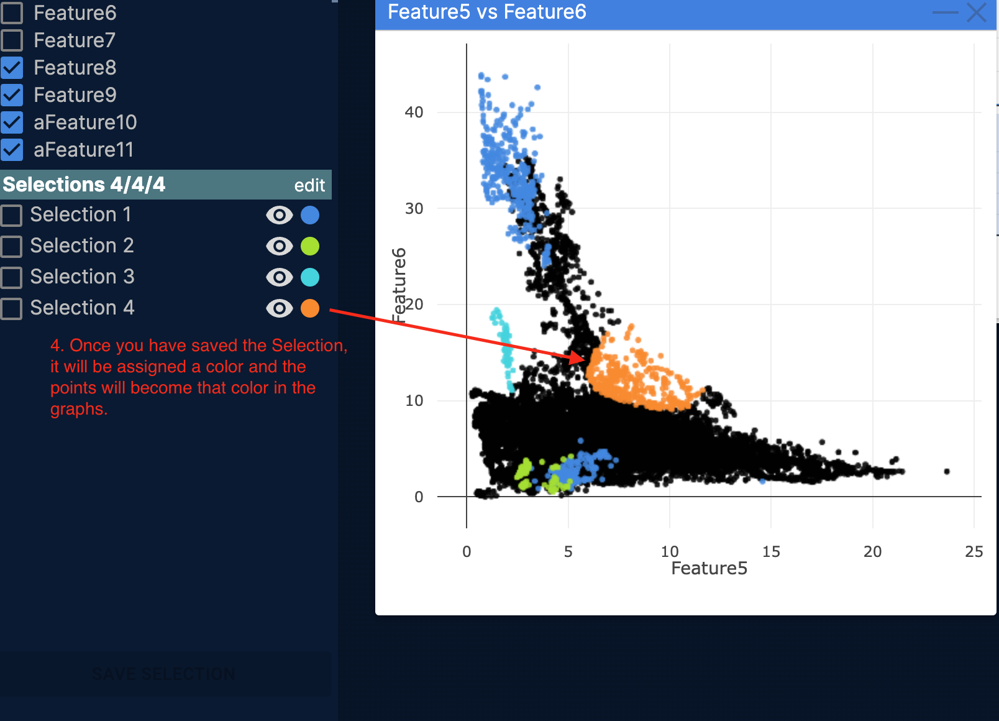
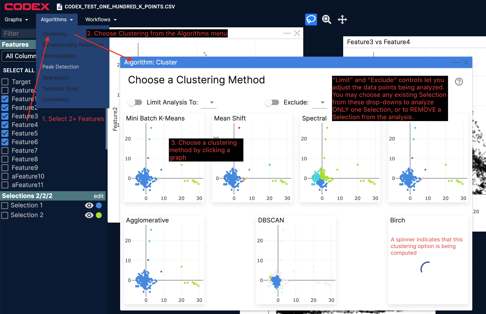
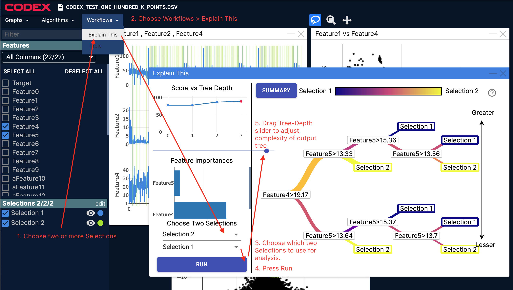

# Using CODEX

CODEX is a web-based application to quickly visualize high-dimensional datasets. It currently accepts the following formats of input data:
- CSV where each row is a data point (approximately a time-point), and each column is a Feature (data attribute)

Currently the application does not take other data formats. It also does not currently interpret time or text data in any way. Text fields are converted to an enumeration—for example, if you have three different text values like red, orange, and blue, those will be converted to 1, 2, and 3 in the data. That way they can be plotted on a chart.

## About the Implementation

CODEX is built on top of SciKit Learn, which is the engine for much of the analysis. Other technical architecture is described in the [subcomponent breakdown](../subcomponent_breakdown.md) document.

## Getting Started

When you first go to the CODEX web site, whether locally or on a server, you will be presented with an empty page that has an UPLOAD button in the upper-left. Press that button and choose a CSV file to upload.

The web application will then process the input file and put the column-headers into the Features list on the top left side.

## Features and Selections

Input to the various type of analysis is done via Features and Selections.

Features are the attributes of the data and come from the column-headers in the original input file. Features can be organized into Features Groups by right-clicking on a Feature or by the Correlation Algorithm. This lets you select or de-select several related Features at once. Features that are in a group are "pointers" to the independent features and not copies; they can be in multiple Feature Groups

Selections are arbitrary groups of rows, and are created within the CODEX web application. There are several ways to create Selections:
- drawing around points in a plot, such as in a scatterplot
- as an output of analysis by an Algorithm, e.g. each cluster created by a Clustering Algorithm will be stored in a Selection
- by Editing existing Selections, such as combining two existing Selections or finding the overlap between two Selections

## Quick Visual Overview

## Analyzing Data

When you select Features or Selections using the checkboxes next to them, options in the Graphs, Algorithms, and Workflows menus will activate. If your current set of selected Features and Selections is not valid for a partiuclar menu option, you can determine how to make it available by mousing over the item which will trigger a message letting you know the input requirements for a particular action.

### Graphs: Plotting Data

To plot data in a Graph, choose 1 or more Feature and then choose which Graph to draw from the dropdown menu. If your current number of selected Features is not valid for a graph you'd like to draw, there is help guidance when you mouse over an option.

To create a selection, draw a lasso around it. This will highlight the same data points across the other graphs. You can save the selection to the Selections list by pressing the Save Selection button in the lower-left, or by pressing shift-s (S).

### Algorithms: Analyzing Data

To run an Algorithm, choose some Features. `Correlation` uses a single Feature and input and the other Algorithms use 2+ Features as inputs. Built-in Help will help you make choices within the tools.

| Algorithm | Input Features | Outputs | Summary |
| --- | --- | --- | --- |
| Clustering | 2+  | 1+ Selections (optionally also Features) | Use various clustering algorithms to compute high-dimensional similarity of rows using multiple Features; can visualize clusters in a scatter plot using princple component analysis (PCA) | 
| Dimensionality Reduction	| 2+		| One Feature	| Use Principle Component Analysis or Independent Component Analysis to reduce 2+ Features into 1 Feature that retains properties of the higher-dimensional information. The single Feature can then be plotted etc.
| Normalization	| 1+		| One Feature per input Feature normalized or standardized	| [https://en.wikipedia.org/wiki/Feature_scaling] Processes Feature data to prepare it for downstream algorithms. Normalization will rescale values within -1 to 1. Standardization will rescale values to have zero mean. |
| Peak Detection	| 1		| One Selection per peak-detection algorithm	| Find peaks and troughs in data based on various algorithms |
| Regression	| 3+ (one used as target)		| Four visualizations	| One Feature is used as a target and the other Features are used by each method (Decision Tree, Random Forest, K Neighbors, or Linear) to estimate the target value. Target vs estimate is visualized along with some statistics. |
| Template Scan	| 2+		| One Selection	| Highlight Positive and Negative patterns on 1+ Feature and find that pattern in a holdout Feature. Save the matched locations in the holdout Feature as a Selection. |
| Correlation	| 2+		| Feature Group	| Select Features by clicking the y-axis labels and then press Add Selected to Group to create a Feature Group with those Features (or add them to an existing group). |

Below is an example of how to trigger the `Clustering` Algorithm.

### Workflows: Higher-level Analysis

To run a Workflow, choose some Selections. `Explain This` uses at least two Selections. The Table tool does not require any Features or Selections to be chosen ahead of time.

Below is an example of how to use the `Explain This` Workflow.

